# TreatUs
A web application which allows users to connect to the local vendors and other door steps service providers. The project is completely based upon the Client-Server architecture.

## User Classifications

There are several types of end users of the application. They are broadly divided as User/Consumers and Vendors . Each of these classes have their own set of features

1. **USER/CONSUMER** who can see all the products (can be filtered by both category wise and the vendor wise), see the list of all the vendors along with their details .

2. **VENDOR/COSTERMONGER** who can register on the web and create, delete (created by himself) and edit products along with locations. There products will automatically be added to the list and other users can see them. They can see the products of other vendors as well (for price comparison). Vendor can edit his own details as well.

## Key Features

1. Each type of user has different types of UI (screens) as per the requirements. These are very userfriendly and anyone can use it. 
2. Completely secure application
3. Easy to use.

## Technology Stack

1. HTML,CSS,JS (frontend)
2. Node.js (backend)
3. MongoDB (database)

## Project Overview

<table>
  <tr>
    <td> 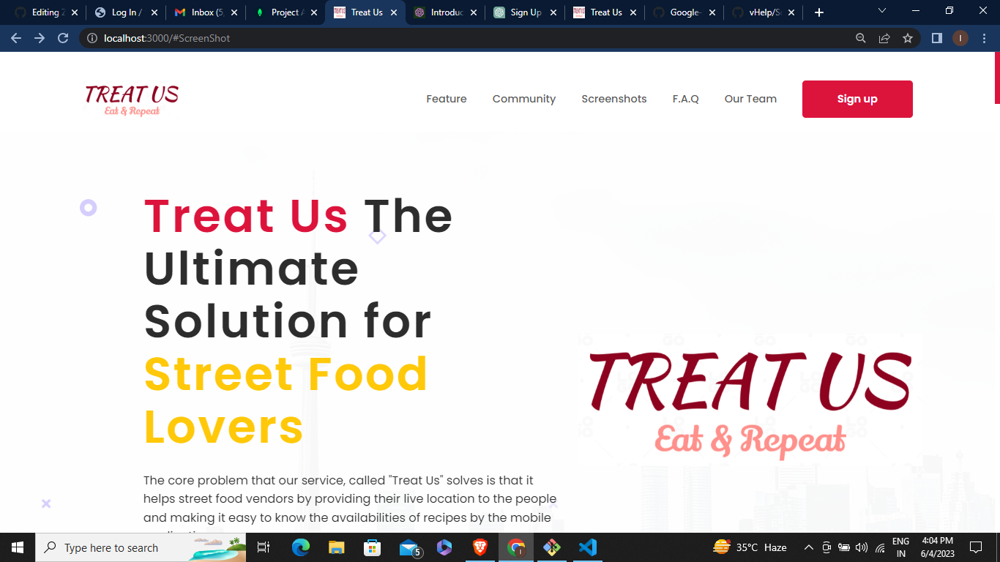 </td>
    <td> 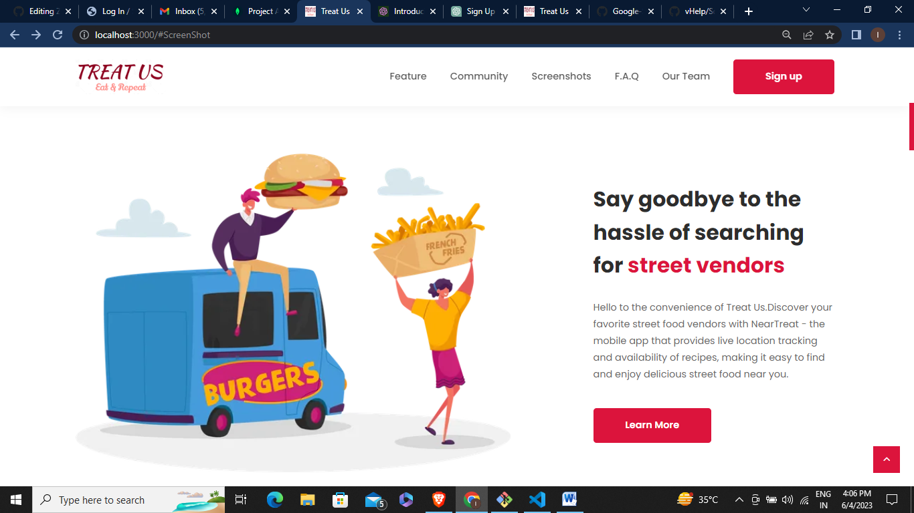</td>
   </tr> 
   <tr>
      <td>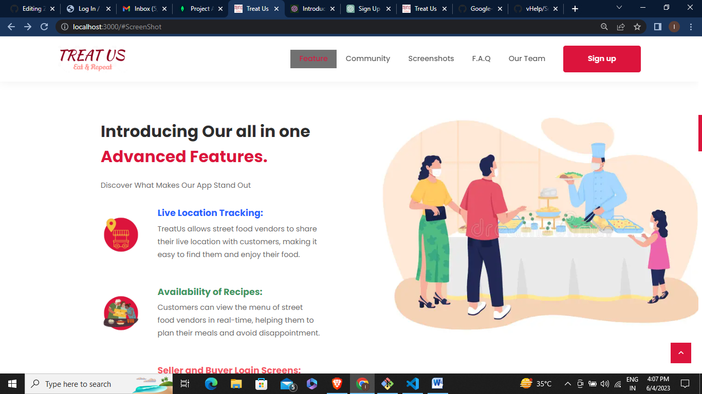</td>
      <td>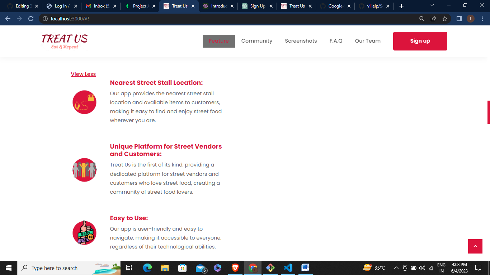</td>
  </tr>
  <tr>
      <td>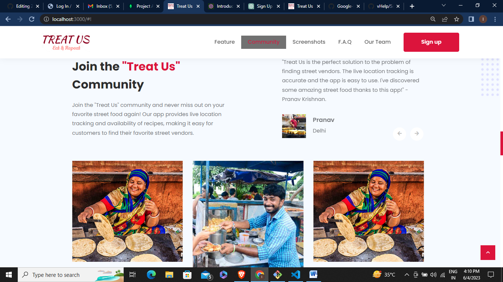</td>
      <td>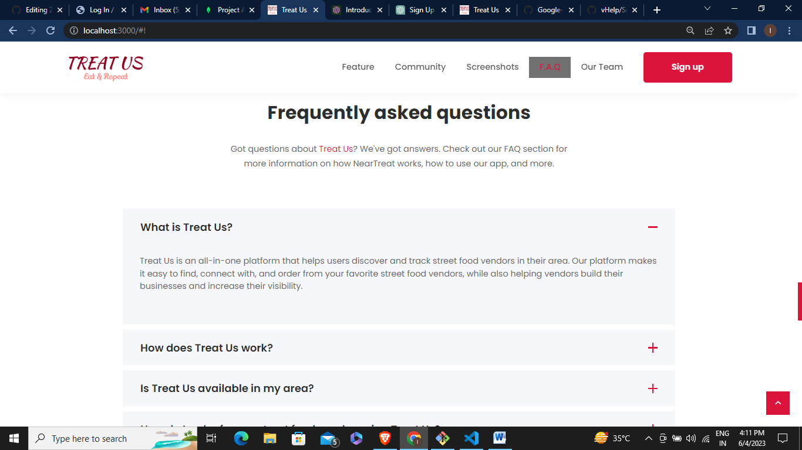</td>
  </tr>
  <tr>
      <td>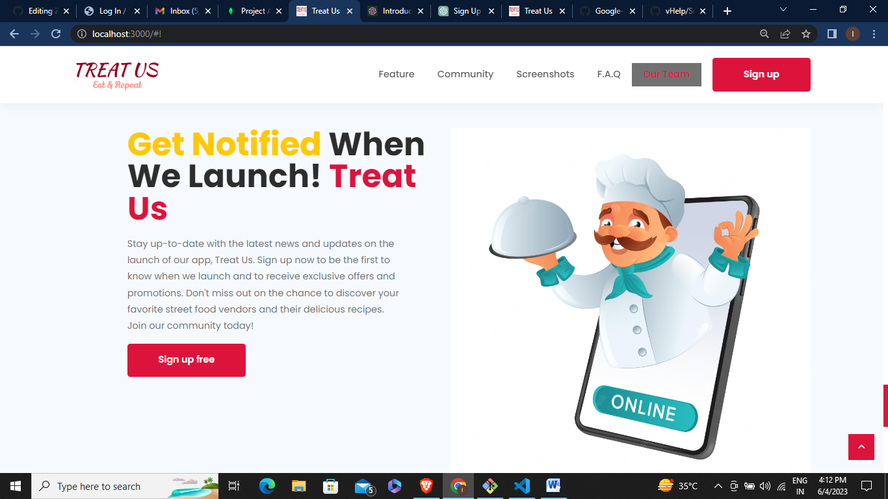</td>
      <td>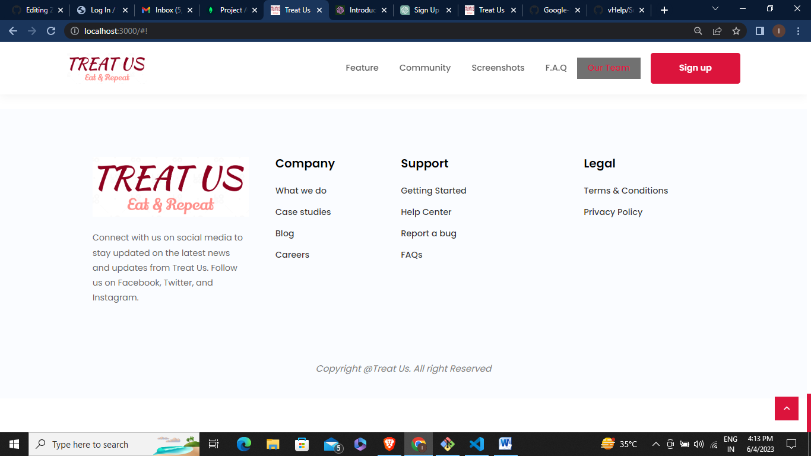</td>
  </tr>
  <tr>
      <td>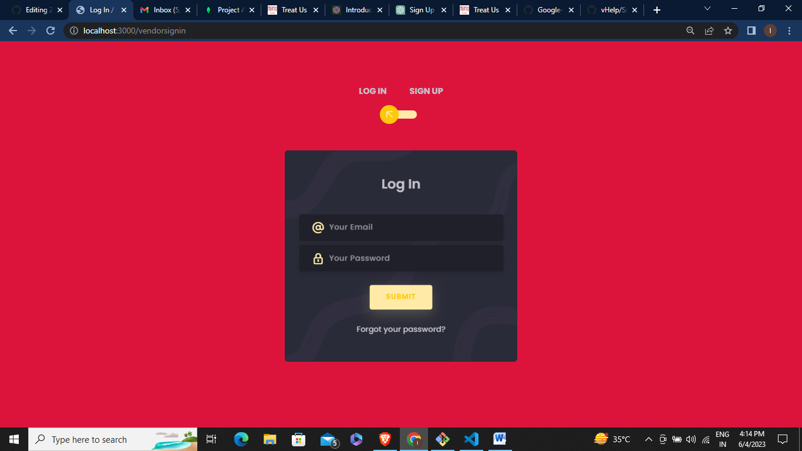</td>
      <td>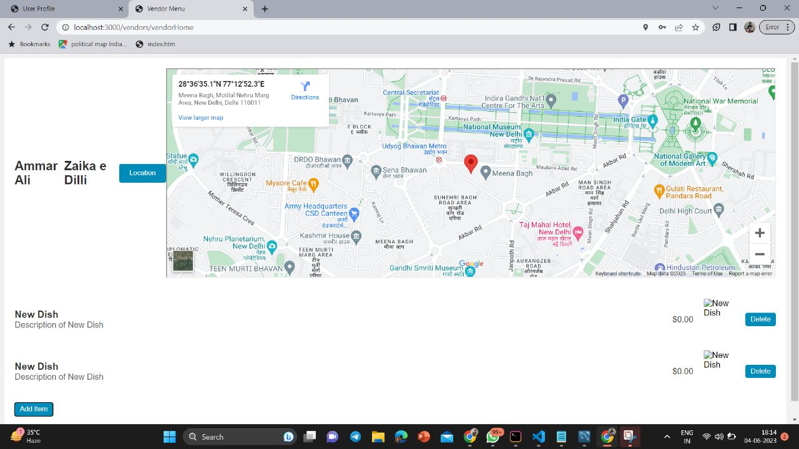</td>
  </tr>
  <tr>
      <td>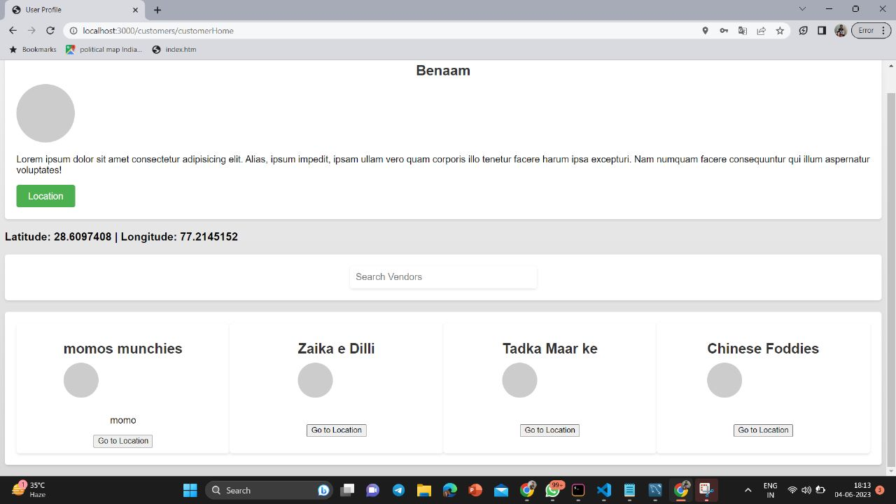</td>
     
  </tr>
</table>
# Available Scripts

In the project terminal, you can run:

### `npm i`

### `npm start`
Open [http://localhost:3000](http://localhost:3000) to view it in the browser.

## Future Work

The project is still work in progress and a few fetures (and bugs) needs to be added (priority wise):

1. Live location tracking of vendors and recommends the nearby vendors within 5 km radius of the user.
2. Adding the feature of `Review` option for the vendors.
3. Dark Mode
# Primary Contributors

* Mayank Jain
* Ishika Jain
* Gunjan Rathore
* Ammar Ali
